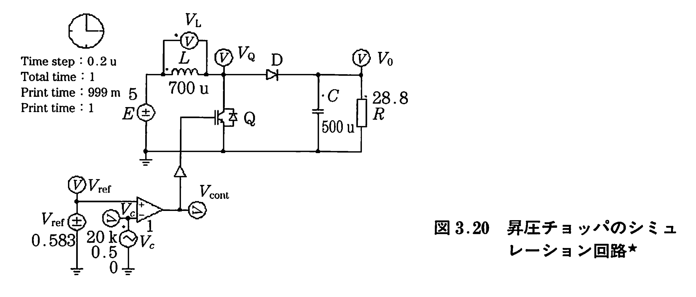
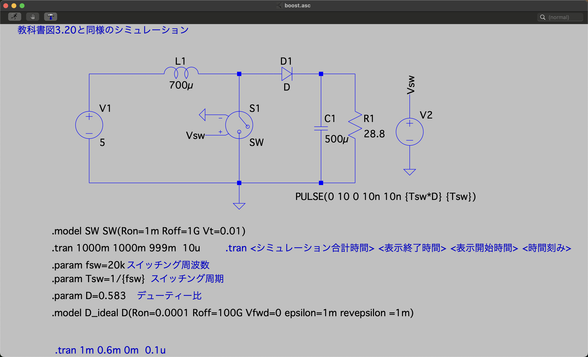

# 昇圧チョッパー回路（Boost Converter）

教科書図3.20に対応する昇圧チョッパー回路のシミュレーションです。入力電圧より高い出力電圧を得ることができます。

## 回路構成





### 回路パラメータ

| 素子 | 記号 | 値 |
|------|------|-----|
| 入力電圧 | V1 | 5 V |
| インダクタンス | L1 | 700 μH |
| コンデンサ | C1 | 500 μF |
| 負荷抵抗 | R1 | 28.8 Ω |
| スイッチング周波数 | fsw | 20 kHz |
| デューティ比 | D | 0.583 |

### 理論出力電圧

昇圧チョッパーの出力電圧は：

```
Vout = Vin / (1 - D)
     = 5 / (1 - 0.583)
     = 5 / 0.417
     ≈ 12 V
```

## 昇圧の原理

### エネルギーの流れ

昇圧チョッパーは、2段階のエネルギー移送で電圧を上げます：

**【スイッチON時】**
1. 電源からコイルにエネルギーを蓄積
2. コイル電流が増加
3. ダイオードは逆バイアス（電流流れず）
4. コンデンサから負荷に電力供給

**【スイッチOFF時】**
1. コイルの磁気エネルギーが放出
2. コイル電圧が反転（逆起電力）
3. 入力電圧 + コイル電圧 → 高電圧
4. ダイオードが順バイアス
5. コンデンサが充電され、負荷に電力供給

### コイル電圧の解析

**ON時：**
```
vL = V0 (正の電圧)
```

**OFF時：**
```
vL = V0 - Vout (負の電圧)
```

**電圧-秒バランス（定常状態）：**
```
V0 × D × T + (V0 - Vout) × (1-D) × T = 0
V0 × T = Vout × (1-D) × T
Vout = V0 / (1-D)
```

## シミュレーション設定

```spice
.tran 1000m 1000m 999m 10u
.param fsw=20k       ; スイッチング周波数 20kHz
.param Tsw=1/{fsw}   ; スイッチング周期 50μs
.param D=0.583       ; デューティ比 58.3%
```

### 長いシミュレーション時間の理由

```
.tran 1000m 1000m 999m 10u
       ↑     ↑     ↑    ↑
       │     │     │    └─ 最大時間刻み 10μs
       │     │     └────── データ保存開始時間 999ms
       │     └──────────── シミュレーション終了時間 1000ms
       └────────────────── 解析時間 1000ms
```

昇圧チョッパーは、コンデンサの充電に時間がかかるため、定常状態に達するまで長い時間を要します。データは最後の1msのみ保存して観察します。

## 観察項目

### 1. 出力電圧 (Vout)

- **目標値**: 12 V
- 起動時は0 Vから徐々に上昇
- 定常状態（999ms以降）で約12 Vに安定
- リプルは小さい（コンデンサで平滑化）

### 2. コイル電流 (IL)

- **平均値**: 約 2.4 A
  - 出力電力 = Vout² / R = 12² / 28.8 ≈ 5 W
  - 入力電力 ≈ 出力電力（理想時）
  - 平均入力電流 = 5 / 5 = 1 A
  - ただし、コイル電流は連続的に流れるため実際はより大きい

- **リプル**: 三角波状に変動
- ON時: 増加
- OFF時: 減少

### 3. ダイオード電流 (ID)

- OFF時のみ流れる
- パルス状の電流
- コンデンサと負荷に電流を供給

### 4. コンデンサ電流 (IC)

- ダイオード電流と負荷電流の差
- ON時: 負（放電）
- OFF時: 正（充電）

## 実験課題

### 1. デューティ比の影響

デューティ比Dを変化させて、出力電圧との関係を確認せよ：

| D | 理論出力電圧 Vout = Vin/(1-D) |
|---|------------------------------|
| 0.5 | 10 V |
| 0.583 | 12 V |
| 0.667 | 15 V |

⚠️ **注意**: Dが1に近づくと出力電圧が非常に高くなり、実用的でない

### 2. 負荷変動の影響

負荷抵抗Rを変化させて、出力電圧の安定性を確認せよ：
- R = 10Ω, 28.8Ω, 50Ω で実験
- 負荷が重い（R小）ほど、電圧降下が大きくなる

### 3. インダクタンスの影響

インダクタンスLを変化させて、電流リプルへの影響を確認せよ：
- L = 300μH, 700μH, 1500μH で実験
- Lが大きいほど、リプルが小さくなる

### 4. コンデンサ容量の影響

コンデンサ容量Cを変化させて、出力電圧リプルへの影響を確認せよ：
- C = 100μF, 500μF, 1000μF で実験
- Cが大きいほど、電圧リプルが小さくなる

## 連続モードと不連続モード

### 連続モード（CCM: Continuous Conduction Mode）

本シミュレーションでは、コイル電流が常に正（連続）である連続モードで動作しています。

**連続モードの条件：**
```
L > Lcrit = (1-D)² × R × T / 2
```

### 不連続モード（DCM: Discontinuous Conduction Mode）

Lが小さいと、コイル電流が0になる期間が生じます（不連続モード）。不連続モードでは、出力電圧の式が異なります。

## 効率の考察

### 理想効率

理想的な昇圧チョッパー（損失なし）の効率は100%です：
```
Pin = Pout
Vin × Iin = Vout × Iout
```

### 実際の損失

実際の回路では、以下の損失があります：
- スイッチのオン抵抗損失
- ダイオードの順方向電圧降下
- インダクタの銅損と鉄損
- スイッチング損失

本シミュレーションでは理想素子を使用しているため、これらの損失は考慮されていません。

## 注意事項

- 起動時の突入電流に注意
- 出力が無負荷の場合、電圧が過剰に上昇する可能性
- Dを1に近づけすぎると制御が不安定になる
- 実際の回路では、フィードバック制御が必要

## 関連ファイル

- 降圧チョッパー: [../Fig3.1_back/](../Fig3.1_back/)
- 昇降圧チョッパー: [../Fig.3.25(b)_back_boost_boost/](../Fig.3.25(b)_back_boost_boost/)

---

[← Lecture5トップに戻る](../)
