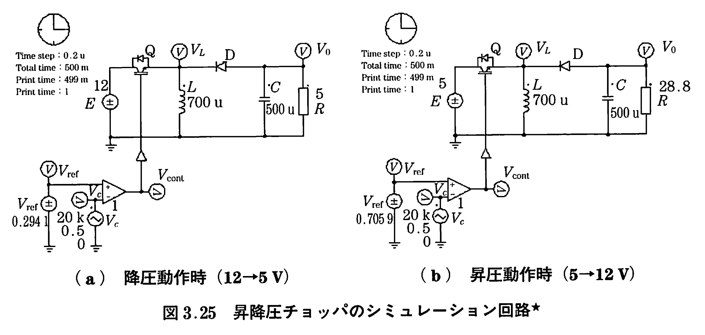
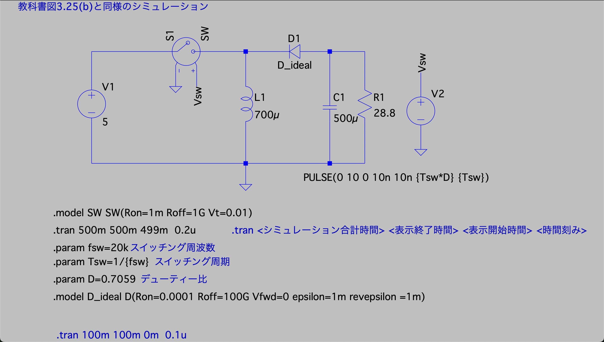

# 昇降圧チョッパー回路（昇圧動作、D > 0.5）

教科書図3.25(b)に対応する昇降圧チョッパー回路の昇圧動作シミュレーションです。

## 回路構成





### 回路パラメータ

| 素子 | 記号 | 値 |
|------|------|-----|
| 入力電圧 | V1 | 5 V |
| インダクタンス | L1 | 700 μH |
| コンデンサ | C1 | 500 μF |
| 負荷抵抗 | R1 | 28.8 Ω |
| スイッチング周波数 | fsw | 20 kHz |
| **デューティ比** | **D** | **0.7059 (> 0.5)** |

### 理論出力電圧

昇降圧チョッパーの出力電圧は：

```
Vout = (D / (1-D)) × Vin
     = (0.7059 / (1-0.7059)) × 5
     = (0.7059 / 0.2941) × 5
     ≈ 12 V
```

**昇圧動作の条件:**
```
D > 0.5  →  D/(1-D) > 1  →  Vout > Vin
```

## 昇降圧チョッパーの特徴

### 回路トポロジー

昇降圧チョッパーは、降圧チョッパーと昇圧チョッパーを組み合わせた構成です：

```
入力 → [スイッチ] → [コイル] → [ダイオード] → [コンデンサ] → 出力
                        ↓
                       GND
```

### 動作原理

**【スイッチON時】**
1. 入力電源からコイルにエネルギー蓄積
2. コイル電流が増加
3. ダイオードは逆バイアス（電流流れず）
4. コンデンサから負荷に電力供給

**【スイッチOFF時】**
1. コイルの磁気エネルギーが放出
2. コイル電流が減少
3. ダイオードが順バイアス
4. コイルからコンデンサ・負荷に電力供給

### 電圧極性

**重要**: 昇降圧チョッパーの出力電圧は、入力電圧と逆極性になります。

## シミュレーション設定

```spice
.tran 500m 500m 499m 0.2u
.param fsw=20k        ; スイッチング周波数 20kHz
.param Tsw=1/{fsw}    ; スイッチング周期 50μs
.param D=0.7059       ; デューティ比 70.59%
```

### D = 0.7059 の計算根拠

目標出力電圧 Vout = 12 V を得るためのデューティ比：

```
Vout = (D / (1-D)) × Vin
12 = (D / (1-D)) × 5
D / (1-D) = 12/5 = 2.4
D = 2.4 × (1-D)
D = 2.4 - 2.4D
D + 2.4D = 2.4
3.4D = 2.4
D = 0.7059
```

## 観察項目

### 1. 出力電圧 (Vout)

- **目標値**: 12 V
- 定常状態で約12 Vに安定
- 入力電圧5 Vより高い（昇圧動作）
- コンデンサにより平滑化

### 2. コイル電流 (IL)

- **平均値**: 約 5 A
  - 出力電力 = Vout² / R = 12² / 28.8 = 5 W
  - 入力から見た平均電流も約5 Wに対応

- 三角波状に変動
- **ON時**: 直線的に増加
- **OFF時**: 直線的に減少

### 3. ダイオード電流 (ID)

- **OFF時のみ流れる**
- パルス状の電流
- コイル電流と同じ波形（OFF時）

### 4. 入力電流 (Iin)

- **ON時のみ流れる**
- スイッチがONの時だけ入力から電流が流れる
- パルス状の電流

## D = 0.5 との比較

### D < 0.5 (降圧動作)

[Fig.3.25(a)](../Fig.3.25(a)_back_boost_back/) を参照

### D = 0.5 (等電圧)

```
Vout = (0.5 / 0.5) × 5 = 5 V (入力と同じ)
```

### D > 0.5 (昇圧動作)

| デューティ比 D | 出力電圧 | 動作モード |
|--------------|---------| ----------|
| 0.6 | 7.5 V | 昇圧 |
| 0.7059 | 12 V | 昇圧 |
| 0.75 | 15 V | 昇圧 |
| 0.8 | 20 V | 昇圧 |

## 実験課題

### 1. デューティ比と出力電圧の関係

デューティ比を変化させて、昇圧動作を確認せよ：

| D | 理論出力電圧 |
|---|-------------|
| 0.6 | 7.5 V |
| 0.7059 | 12 V |
| 0.75 | 15 V |
| 0.8 | 20 V |

### 2. D = 0.5 付近の動作

D = 0.5 に近い値でシミュレーションし、境界条件を観察せよ：
- D = 0.48, 0.50, 0.52
- 出力電圧の変化を確認

### 3. 負荷変動

負荷抵抗を変化させて、出力電圧の安定性を確認せよ：
- R = 10Ω, 28.8Ω, 50Ω
- 負荷電流の変化を観察

### 4. 連続モードの確認

コイル電流が常に正であること（連続モード）を確認せよ。インダクタンスを小さくすると、不連続モードになる可能性がある：
- L = 300μH, 700μH, 1500μH で実験

## エネルギーの流れ

### ON時のエネルギー

```
電源 → コイル（蓄積）
コンデンサ → 負荷
```

### OFF時のエネルギー

```
コイル（放出） → コンデンサ & 負荷
```

## 昇圧チョッパーとの違い

### 昇圧チョッパー

- 出力電圧は常に入力より高い
- 出力電圧範囲: Vin < Vout < ∞
- 極性: 同じ

### 昇降圧チョッパー（昇圧動作）

- 出力電圧は入力より高いが、降圧も可能
- 出力電圧範囲: 0 < Vout < ∞
- 極性: **反転**

## 注意事項

- 出力電圧の極性が入力と逆になる
- 定常状態に達するまで時間がかかる（シミュレーション時間500ms）
- コイル電流が0にならないよう、Lを適切に選ぶ
- D = 0.5 付近では、ゲイン感度が高い
- D が 1 に近づくと理論的には出力電圧が無限大に近づくが、実際は損失により制限される

## 関連ファイル

- 降圧動作（D < 0.5）: [../Fig.3.25(a)_back_boost_back/](../Fig.3.25(a)_back_boost_back/)
- 降圧チョッパー: [../Fig3.1_back/](../Fig3.1_back/)
- 昇圧チョッパー: [../Fig.3.20_boost/](../Fig.3.20_boost/)

---

[← Lecture5トップに戻る](../)
