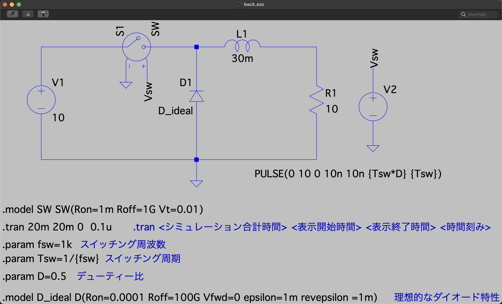

# 降圧チョッパー回路（基本回路）

教科書図3.1に対応する基本的な降圧チョッパー回路のシミュレーションです。

## 回路構成



### 回路パラメータ

| 素子 | 記号 | 値 |
|------|------|-----|
| 入力電圧 | V1 | 10 V |
| インダクタンス | L1 | 30 mH |
| 負荷抵抗 | R1 | 10 Ω |
| スイッチング周波数 | fsw | 1 kHz |
| デューティ比 | D | 0.5 |

### 理論出力電圧

降圧チョッパーの出力電圧は：

```
Vout = D × Vin = 0.5 × 10 = 5 V
```

## シミュレーション設定

```spice
.tran 20m 20m 0 0.1u
.param fsw=1k        ; スイッチング周波数 1kHz
.param Tsw=1/{fsw}   ; スイッチング周期 1ms
.param D=0.5         ; デューティ比 50%
```

### パルス信号設定

```spice
PULSE(0 10 0 10n 10n {Tsw*D} {Tsw})
```

- 初期電圧: 0 V
- ON電圧: 10 V
- 遅延時間: 0 s
- 立ち上がり/立ち下がり時間: 10 ns
- ON時間: Tsw × D = 0.5 ms
- 周期: Tsw = 1 ms

## 観察項目

### 1. コイル電圧 (vL)

- **ON時**: 約 +10 V（正の電圧）
- **OFF時**: 約 -5 V（負の電圧）
- **平均値**: 定常状態では0 V（電圧-秒バランス）

### 2. コイル電流 (iL)

- 三角波状に変動
- **平均値**: 約 0.5 A（= Vout / R = 5 / 10）
- **リプル**: 電流の振動幅を確認

計算式：
```
ΔiL = (Vin × D × (1-D) × T) / L
    = (10 × 0.5 × 0.5 × 0.001) / 0.03
    = 約 0.083 A
```

### 3. 負荷電圧 (vR)

- コイル電流に比例して変動
- **平均値**: 約 5 V
- リプルを含む

### 4. スイッチ電圧 (Vsw)

- **ON時**: 0 V
- **OFF時**: 10 V
- 矩形波

## 実験課題

1. デューティ比Dを変化させて、出力電圧との関係を確認せよ
   - D = 0.3, 0.5, 0.7 で実験
   - 理論値 Vout = D × Vin と比較

2. インダクタンスLを変化させて、電流リプルへの影響を確認せよ
   - L = 10mH, 30mH, 100mH で実験
   - リプル ΔiL を測定

3. スイッチング周波数fswを変化させて、電流リプルへの影響を確認せよ
   - fsw = 500Hz, 1kHz, 2kHz で実験

## 注意事項

- この回路にはコンデンサがないため、出力電圧リプルが大きい
- 実際の回路では、出力にコンデンサを追加する（back_withC を参照）
- ダイオードは理想特性（順方向電圧降下 Vf = 0 V）

## 関連ファイル

- コンデンサ付き回路: [../back_withC/](../back_withC/)
- 演習問題: [../ensyu_back/](../ensyu_back/)

---

[← Lecture5トップに戻る](../)
