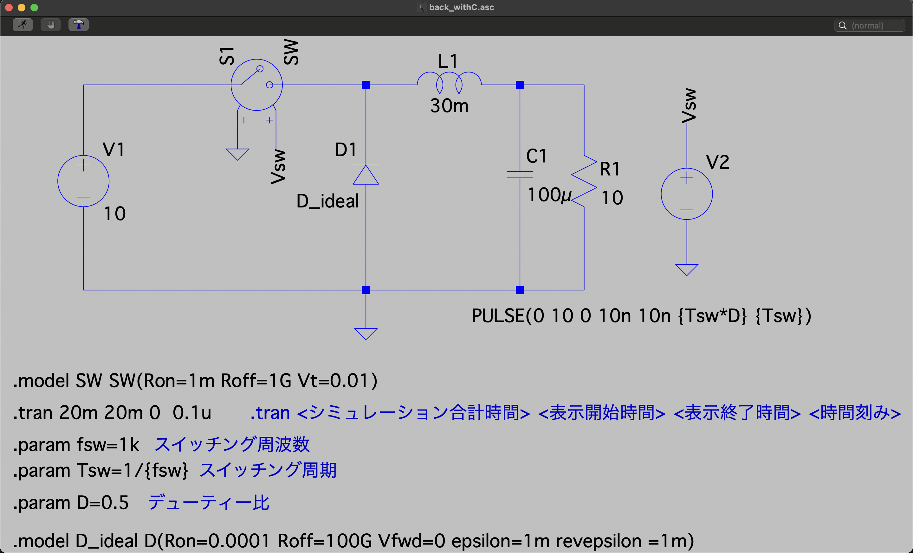

# 降圧チョッパー回路（コンデンサ付き）

出力にコンデンサを追加して電圧リプルを低減した降圧チョッパー回路のシミュレーションです。

## 回路構成



### 回路パラメータ

| 素子 | 記号 | 値 |
|------|------|-----|
| 入力電圧 | V1 | 10 V |
| インダクタンス | L1 | 30 mH |
| **コンデンサ** | **C1** | **100 μF** |
| 負荷抵抗 | R1 | 10 Ω |
| スイッチング周波数 | fsw | 1 kHz |
| デューティ比 | D | 0.5 |

### 理論出力電圧

```
Vout = D × Vin = 0.5 × 10 = 5 V
```

## コンデンサの役割

### 電圧平滑化

コンデンサは、コイル電流のリプルを吸収し、出力電圧を安定化します。

**動作原理：**

1. **コイル電流が平均値より大きい時**
   - 余剰電流がコンデンサを充電
   - コンデンサに電荷が蓄積

2. **コイル電流が平均値より小さい時**
   - コンデンサが放電して負荷に供給
   - コンデンサから電荷が放出

### 出力電圧リプルの計算

出力電圧リプル ΔVout は以下で近似できます：

```
ΔVout ≈ ΔiL / (8 × f × C)
```

ここで：
- ΔiL: コイル電流リプル = 0.083 A（前節参照）
- f: スイッチング周波数 = 1 kHz
- C: コンデンサ容量 = 100 μF

計算すると：
```
ΔVout ≈ 0.083 / (8 × 1000 × 100e-6)
      ≈ 0.104 V = 104 mV
```

## シミュレーション設定

```spice
.tran 20m 20m 0 0.1u
.param fsw=1k        ; スイッチング周波数
.param Tsw=1/{fsw}   ; スイッチング周期
.param D=0.5         ; デューティ比
```

## 観察項目

### 1. 出力電圧 (Vout)

- **平均値**: 約 5 V
- **リプル**: 大幅に低減（Fig3.1_backと比較）
- ほぼ一定の電圧

### 2. コンデンサ電流 (IC)

- コイル電流と負荷電流の差分
- 正弦波に近い波形
- リプル電流を吸収

### 3. 負荷電流 (IR)

- ほぼ一定（= Vout / R ≈ 0.5 A）
- コンデンサにより平滑化

### 4. コイル電流 (IL)

- 基本回路と同様に三角波
- リプルの大きさは変わらない

## 比較実験

### コンデンサなし vs. あり

| 項目 | コンデンサなし<br>(Fig3.1_back) | コンデンサあり<br>(back_withC) |
|------|-------------------------------|------------------------------|
| 出力電圧リプル | 大きい | 小さい |
| 負荷電流 | 変動大 | ほぼ一定 |
| 電圧波形 | 三角波に近い | ほぼ平坦 |

## 実験課題

1. コンデンサ容量Cを変化させて、出力電圧リプルへの影響を確認せよ
   - C = 10μF, 100μF, 1000μF で実験
   - リプル ΔVout を測定
   - 理論値と比較

2. スイッチング周波数fswを変化させて、リプルへの影響を確認せよ
   - fsw = 500Hz, 1kHz, 2kHz で実験
   - 周波数が高いほどリプルが減少することを確認

3. コンデンサのESR（等価直列抵抗）を追加して、実際のコンデンサの挙動を確認せよ
   - コンデンサと直列に小さな抵抗（例: 0.1Ω）を追加
   - 出力電圧への影響を観察

## LCフィルタの設計

### カットオフ周波数

LCフィルタのカットオフ周波数は：

```
fc = 1 / (2π√(LC))
   = 1 / (2π√(30e-3 × 100e-6))
   ≈ 291 Hz
```

スイッチング周波数（1 kHz）よりも十分低いため、高周波成分が効果的に除去されます。

## 注意事項

- コンデンサの初期電圧は0 Vから開始
- 過渡状態を経て定常状態に達する
- 実際のコンデンサにはESRやESLがあり、性能に影響する

## 関連ファイル

- 基本回路（コンデンサなし）: [../Fig3.1_back/](../Fig3.1_back/)
- 演習問題: [../ensyu_back/](../ensyu_back/)

---

[← Lecture5トップに戻る](../)
