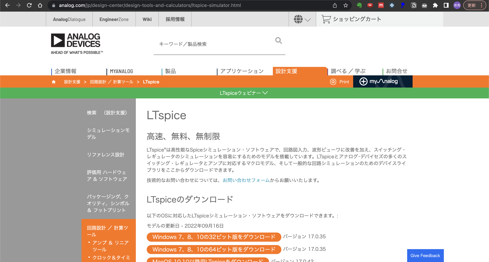
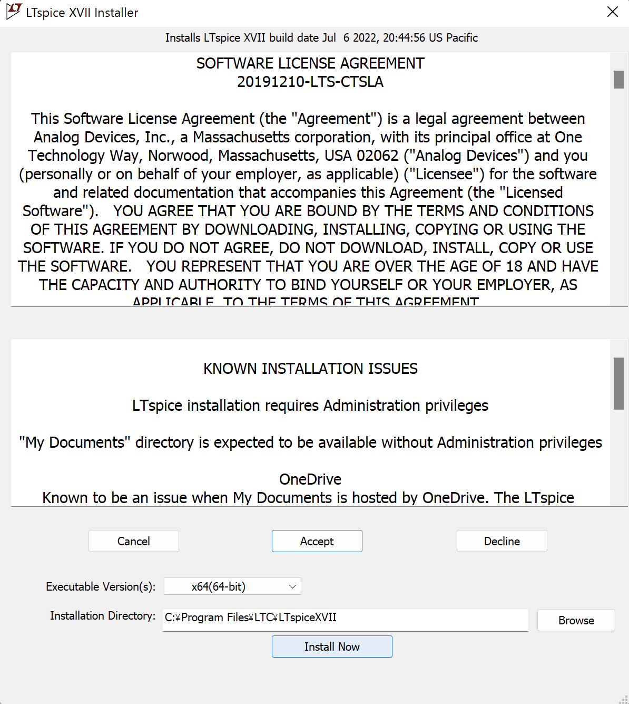
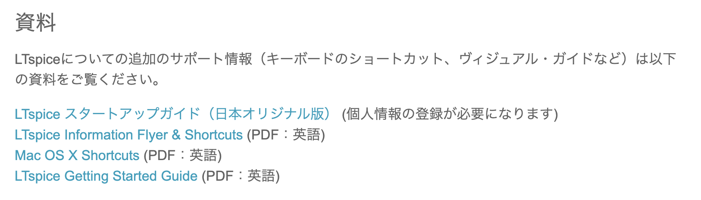
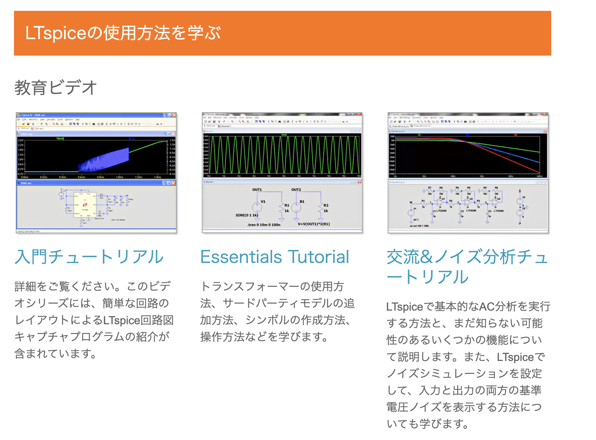

# LTspiceのインストール

LTspiceのダウンロードとインストール方法を説明します。

> ⚠️ **注意**: バージョンが変わっているのでインストール方法が変わっているかもしれません。もしできなければ連絡ください。

## ダウンロード

### 公式ダウンロードサイト

[LTspice - Analog Devices](https://www.analog.com/jp/design-center/design-tools-and-calculators/ltspice-simulator.html)

### 対応OS

- **Windows**: Windows 7, 8, 10, 11対応
- **macOS**: 利用可能（ただし、使い方がWindowsと少し異なる）



## インストール手順

### 1. インストーラーの実行

ダウンロードしたexeファイルを開くと、インストーラが起動します。



### 2. ライセンス同意

ライセンスに同意すると、インストールが開始されます。

### 3. インストール完了

デフォルトでは、以下のディレクトリにLTspiceがインストールされます：

```
C:\Program Files\LTC\LTspiceXVII
```

インストールが完了したら、LTspiceを起動して使用できます。

## 参考資料

### 公式マニュアル

ダウンロードサイトのページ下部から入手できます（個人情報の登録が必要）。



### 動画チュートリアル

公式サイトには動画でのチュートリアルもあります。



## 次のステップ

インストールが完了したら、[基本的な使い方](../02_getting_started/README.md)に進んでください。

---

[← 目次に戻る](../README.md)
