# LTspice 基本的な使い方

回路図の作成からシミュレーション実行まで、基本的な使い方を学びます。

## 📝 目次

1. [回路図エディタの表示](#回路図エディタの表示)
2. [素子の配置](#素子の配置)
3. [素子の配線](#素子の配線)
4. [グランドの接続](#グランドの接続)
5. [素子の値の設定](#素子の値の設定)
6. [シミュレーションの設定](#シミュレーションの設定)
7. [シミュレーションの実行](#シミュレーションの実行)
8. [波形の表示](#波形の表示)

---

## 回路図エディタの表示

LTspiceを起動すると、以下の画面が表示されます。

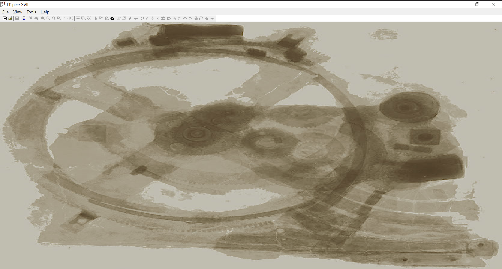

回路のシミュレーションをするために、回路図を作成します。

**File > New Schematic** をクリックすると、回路図エディタが表示されます。

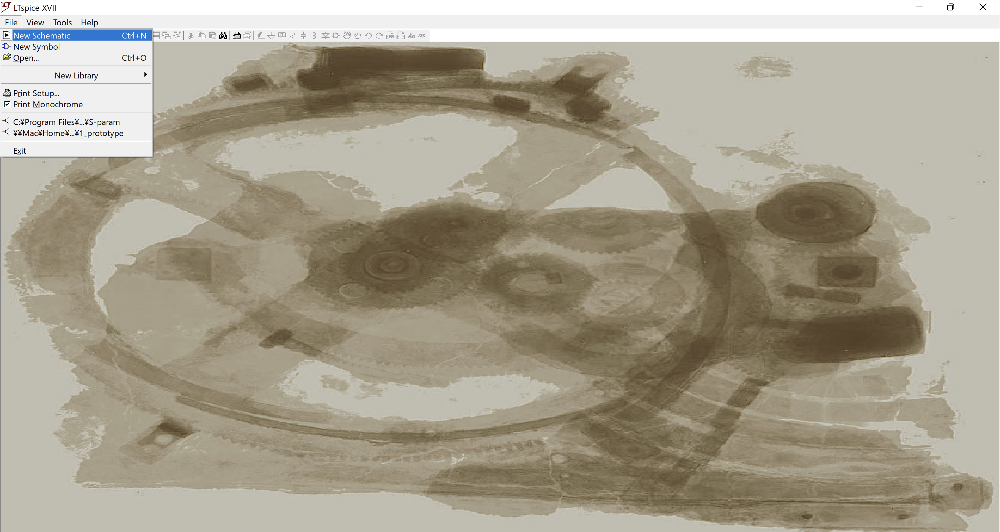

回路図エディタを開くと、背景が灰色の画面が表示されます。ここに回路の素子を配置して回路を作ります。

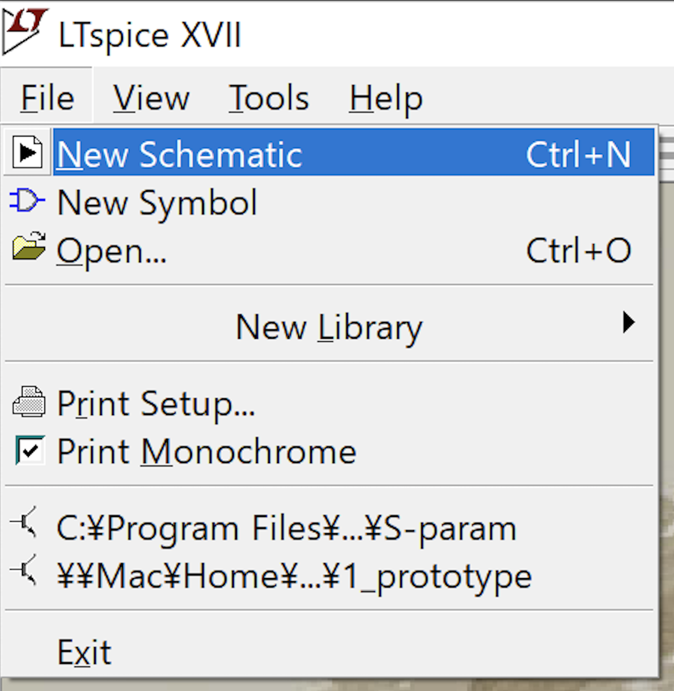

---

## 素子の配置

回路の素子はアイコンを選択すれば配置できるようになります。

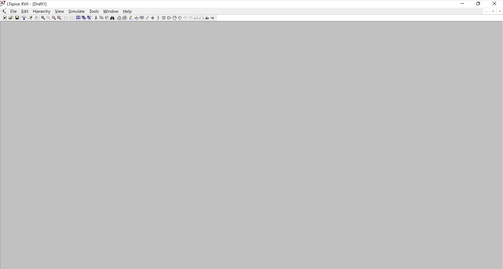

### 素子の検索方法

または、**F2キー**か、**右クリック > Draft > Component** で全ての素子を探すことができます。検索窓から素子の名前を検索すると、探せます。

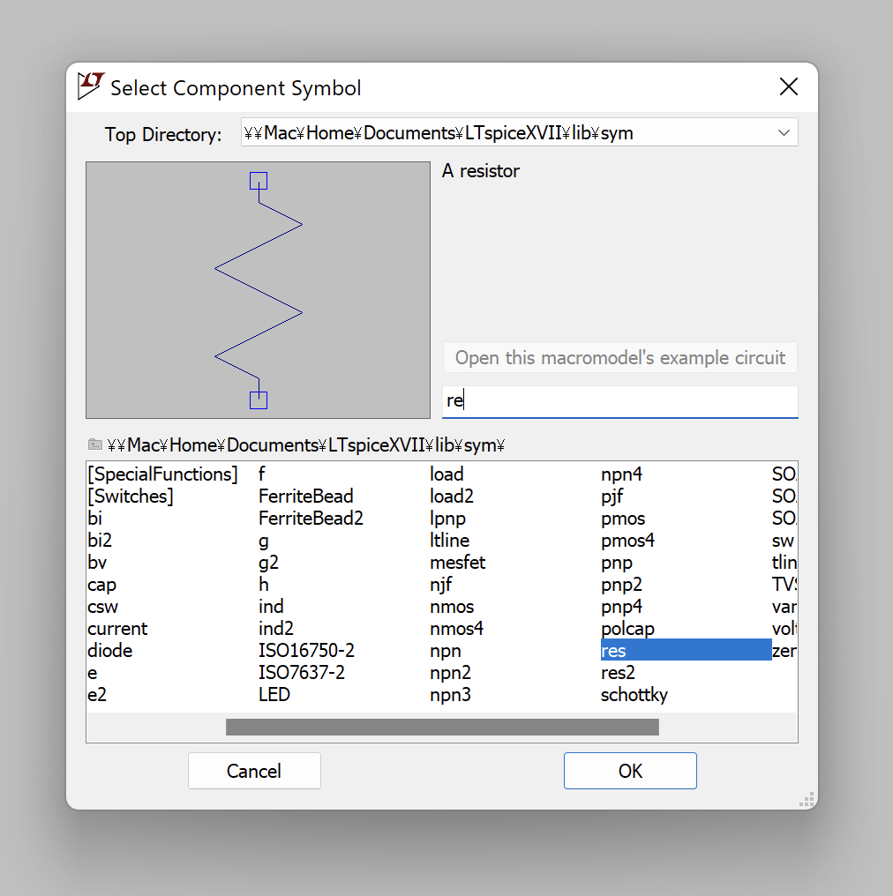

---

## 素子の配線

素子を配置したら、次は素子同士を配線します。

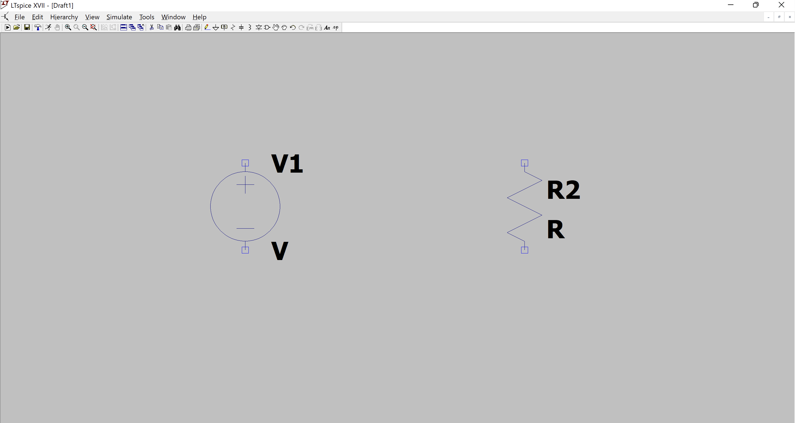

以下のアイコンまたは **F3キー** で配線モードになり、配線を行うことができます。

青い配線で接続されていることがわかります。

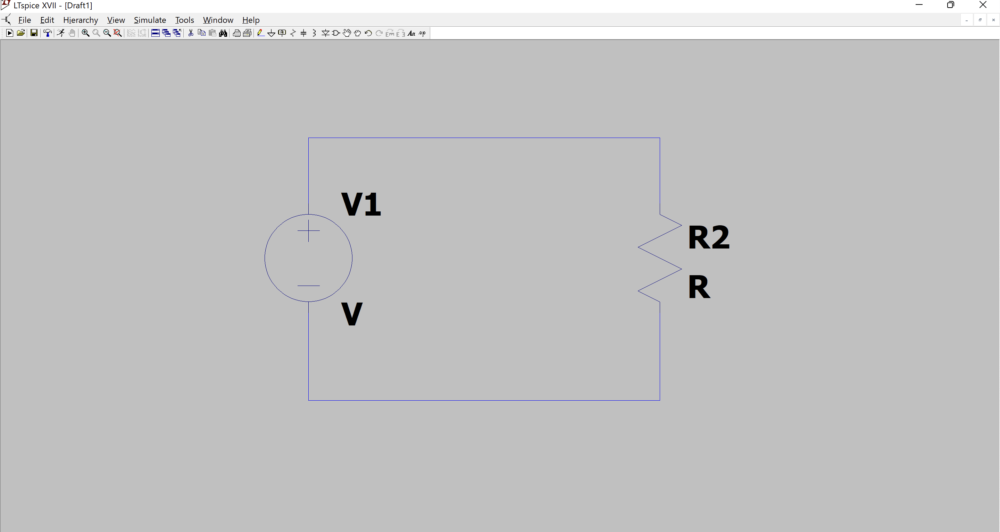

---

## グランドの接続

LTspiceではグランド（GND）の接続が必須です。グランドがないとシミュレーションエラーになります。

グランドは **G キー** または **右クリック > Draft > Net Name** から配置できます。

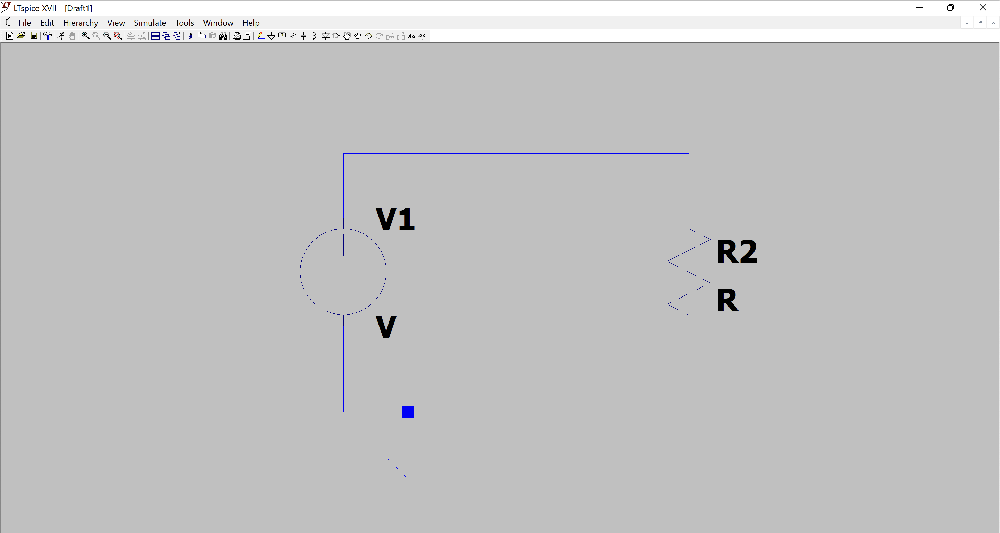

---

## 素子の値の設定

素子をクリックすると、値を設定できます。

### 抵抗値の設定例

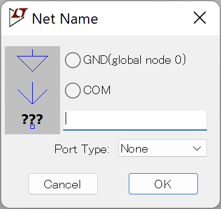

### 電圧源の設定

電圧源をクリックすると、以下のような設定画面が表示されます。

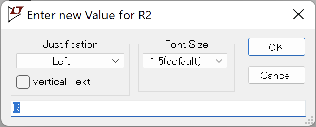

**主な設定項目：**
- **DC value**: 直流電圧値
- **AC Amplitude**: 交流振幅
- **Small signal AC analysis**: AC解析用の設定

### パルス電圧源の設定

時間変化する電圧源を設定する場合は、**PULSE** を選択します。

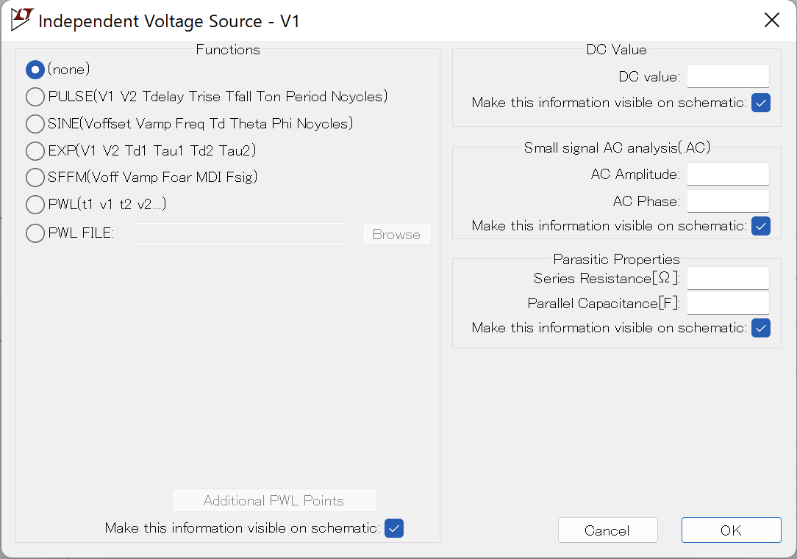

**PULSEパラメータ：**
- **Vinitial**: 初期電圧
- **Von**: ON時の電圧
- **Tdelay**: 遅延時間
- **Trise**: 立ち上がり時間
- **Tfall**: 立ち下がり時間
- **Ton**: ON時間
- **Tperiod**: 周期

---

## シミュレーションの設定

回路図が完成したら、シミュレーション条件を設定します。

### 過渡解析（Transient Analysis）

**Simulate > Edit Simulation Cmd** または **S キー** でシミュレーション設定画面を開きます。

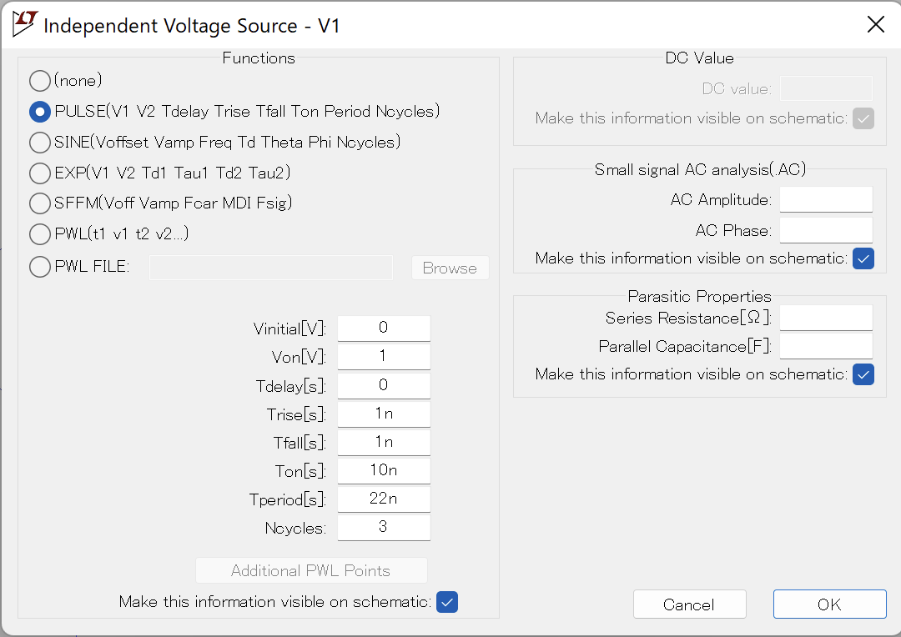

**主な設定項目：**
- **Stop time**: シミュレーション終了時間
- **Time to start saving data**: データ保存開始時間
- **Maximum Timestep**: 最大時間刻み

設定後、OKボタンを押すと、回路図上に `.tran` コマンドが表示されます。これをクリックして配置します。

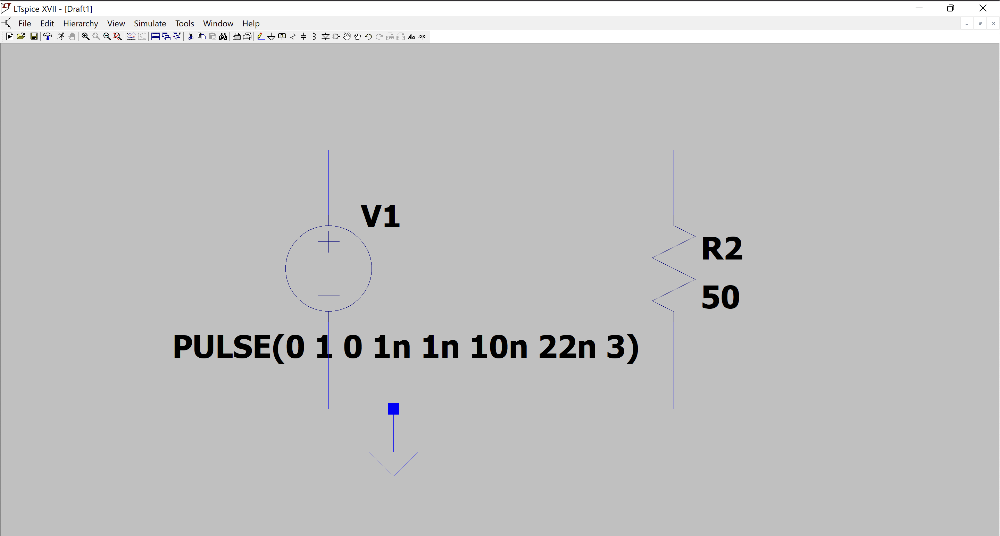

---

## シミュレーションの実行

設定が完了したら、**Simulate > Run** または **実行ボタン** をクリックします。

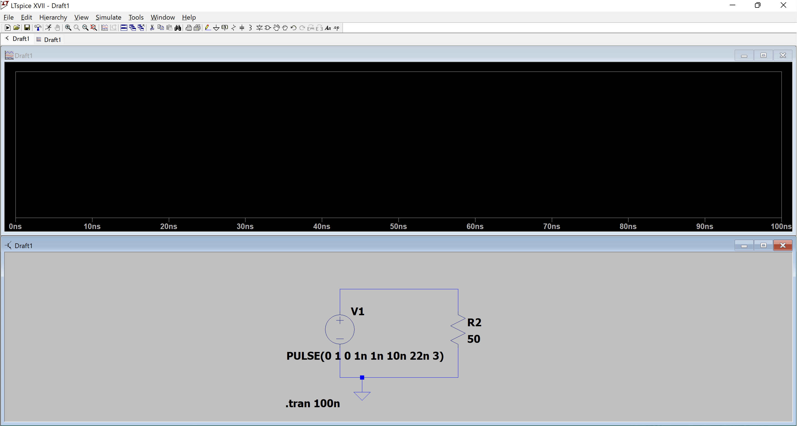

シミュレーションが実行されると、波形ビューアが表示されます。

---

## 波形の表示

### 電圧の測定

配線をクリックすると、その点の電圧波形が表示されます。

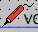

### 電流の測定

素子の本体部分をクリックすると、その素子を流れる電流波形が表示されます。

### 電力の測定

**Altキー** を押しながら素子をクリックすると、電力波形が表示されます。

---

## 便利なショートカットキー

| キー | 機能 |
|------|------|
| F2 | 素子の配置 |
| F3 | 配線モード |
| G | グランドの配置 |
| R | 抵抗の配置 |
| C | コンデンサの配置 |
| L | インダクタの配置 |
| S | シミュレーション設定 |
| Esc | 選択解除 |
| Delete | 削除 |
| Ctrl+Z | 元に戻す |
| Ctrl+Y | やり直し |

---

## 次のステップ

基本的な使い方を習得したら、以下に進んでください：
- [Sパラメータ解析](../03_s_parameters/README.md) - フィルタ回路の周波数特性を解析
- [Tips](../tips/) - より高度な使い方やカスタマイズ

---

[← 目次に戻る](../README.md)
