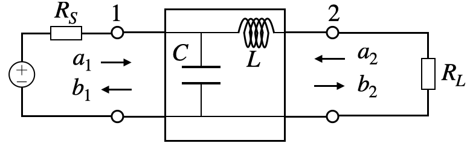

# Sパラメータ解析

LCローパスフィルタのSパラメータを解析する方法を学びます。

## 📝 概要

本チュートリアルでは、$\omega=1$が-3dBのカットオフ周波数となる原型ローパスフィルタのSパラメータを解析します。



---

## 1. 回路図の作成

まずLTspiceで回路図を作成します。


**回路構成：**
- インダクタ L = 1H
- コンデンサ C = 1F
- 入力ポート（Port 1）: 電圧源 V1
- 出力ポート（Port 2）: 負荷抵抗 R1 = 1Ω

---

## 2. AC解析の設定

シミュレーション実行ボタンをクリックすると、設定画面が表示されます。


### 設定パラメータ

**Type of sweep（スイープタイプ）：**
- **Decade**: 周波数が10倍になるまでの点を設定（対数スケール）
- **Octave**: 2倍ごとに点を取る
- **Linear**: 等間隔に点を取る

今回は横軸を対数で表すため **Decade** を選択します。

**Number of points per decade：**
- 周波数が10倍になるごとに取る点の数
- 今回は **100点** に設定

**Start frequency / Stop frequency：**
- 計算を開始/終了する周波数
- 今回は **0.01 Hz** から **1 Hz** まで

### SPICEディレクティブでの設定

設定画面を使わず、直接入力することもできます：

```spice
.ac dec 100 0.01 1
```

---

## 3. ネットワーク解析（.net）コマンド

Sパラメータを解析するために、回路網解析コマンドを使用します。

### コマンド構文

```spice
.net [V(out[,ref])|I(Rout)] <Vin|Iin> [Rin=<val>] [Rout=<val>]
```

**パラメータ説明：**

| パラメータ | 必須/任意 | 説明 |
|-----------|----------|------|
| `[V(out[,ref])\|I(Rout)]` | 任意 | 出力ポート（ポート2）の設定。省略時はポート1のみ解析（S11, Z11など） |
| `<Vin\|Iin>` | 必須 | 入力ポート（ポート1）の設定 |
| `[Rin=<val>]` | 任意 | 入力ポートの抵抗値。省略時は1Ωまたはポートの抵抗値 |
| `[Rout=<val>]` | 任意 | 出力ポートの抵抗値。省略時は1Ωまたはポートの抵抗値 |

### ⚠️ 重要な注意点

入力ポートの抵抗値を1Ωとしたい場合、以下のいずれかの方法を使います：

1. **電圧源の内部抵抗を設定** - 外部抵抗を削除し、電圧源の設定で抵抗値を指定
2. **Rin=1を明示的に指定** - `.net`コマンドで `Rin=1` を指定

今回は `Rin=1` を使用します。最終的な回路図とコマンドは以下のようになります：


```spice
.ac dec 100 0.01 1
.net V(out) V1 Rin=1
```

---

## 4. シミュレーションの実行

シミュレーションを実行すると、波形ビューアが表示されます。


### Sパラメータの表示

グラフ上で **右クリック > Add Trace** をクリックすると、測定可能なパラメータのリストが表示されます。


ノード電圧や枝電流に加えて、以下のパラメータが追加されています：
- **Sパラメータ** (S11, S12, S21, S22)
- **Zパラメータ** (Z11, Z12, Z21, Z22)
- **Yパラメータ** (Y11, Y12, Y21, Y22)

今回は **S21**（透過特性）を選択して表示します。

---

## 5. 結果の確認

S21の周波数特性が表示されます。


**結果の確認：**
- カットオフ周波数 $f = \frac{1}{2\pi} \approx 0.159$ Hz で -3dB となることが確認できます
- これは設計仕様（$\omega=1$ で-3dB）と一致しています

---

## 補足：パラメータの意味

### Sパラメータ

| パラメータ | 意味 |
|-----------|------|
| S11 | 入力反射係数（入力インピーダンスマッチング） |
| S21 | 順方向伝送係数（透過特性） |
| S12 | 逆方向伝送係数（逆方向アイソレーション） |
| S22 | 出力反射係数（出力インピーダンスマッチング） |

### デシベル表示

- 0 dB = 透過率100%（全て通過）
- -3 dB = 透過率約50%（パワー半減点）
- -20 dB = 透過率10%

---

## 応用例

この手法は以下のような回路解析に応用できます：
- バンドパスフィルタの設計
- ハイパスフィルタの解析
- インピーダンス整合回路の評価
- アンテナの特性解析

---

[← 目次に戻る](../README.md)
